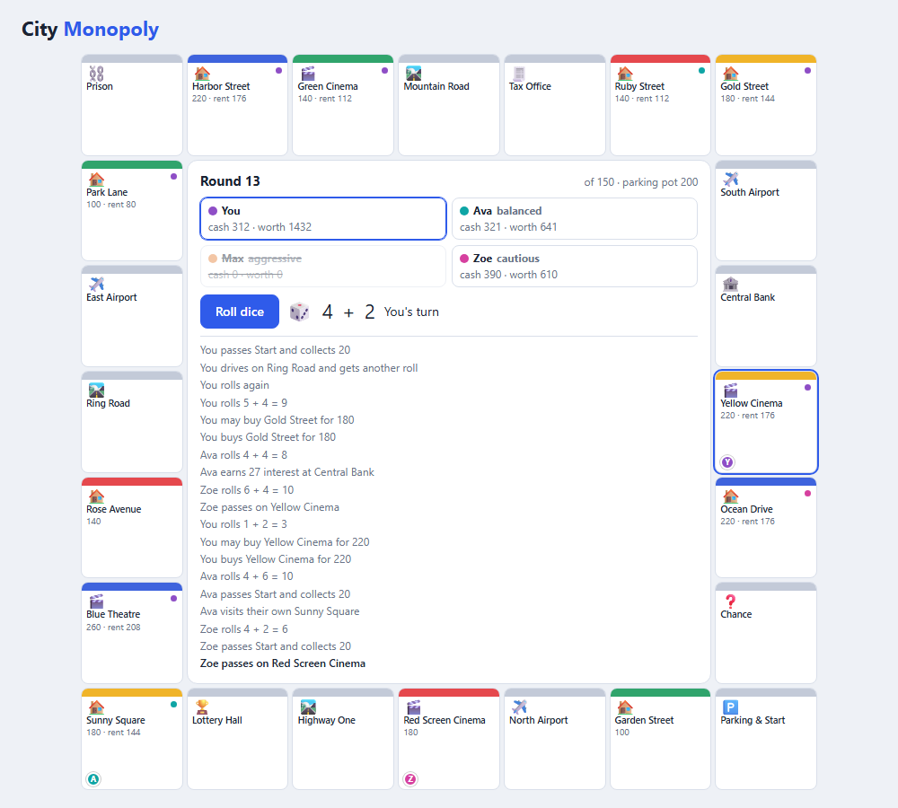
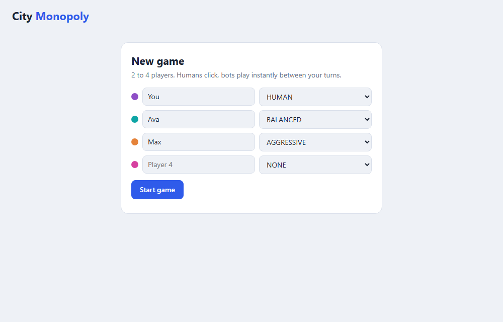

# City Monopoly


A property-trading board game for 2 to 4 players, written in plain Java 17 with no dependencies.
It ships with a deterministic **rules engine**, a **browser UI**, a **terminal mode**, three kinds of
**bot opponents**, and a **simulator** that plays thousands of games to measure how balanced the
rules are.



## Quick start

Requires JDK 17+.

```bash
mkdir out
javac -d out $(find src/main -name '*.java')
cp -r src/main/resources/* out/
java -cp out monopoly.Main web          # then open http://127.0.0.1:8080/
```

On Windows PowerShell:

```powershell
New-Item -ItemType Directory out -Force | Out-Null
javac -d out (Get-ChildItem -Recurse src/main -Filter *.java).FullName
Copy-Item -Recurse -Force src/main/resources/* out/
java -cp out monopoly.Main web
```

| Command | What it does |
|---|---|
| `java -cp out monopoly.Main web [--port N] [--host H]` | Browser game (pick humans and bots on the start screen) |
| `java -cp out monopoly.Main cli Ann Bob bot:aggressive` | Hot-seat game in the terminal; names are humans, `bot:<strategy>` adds a bot |
| `java -cp out monopoly.Main simulate [--games N] [--seed S]` | Balance report from all-bot games |



## The game

A 24-square ring. Roll two dice, move, and resolve the square you land on. Buy properties, collect
rent from opponents, and be the last player left, or the richest when round 150 is reached.

| Square | Effect |
|---|---|
| **Land** (`Garden Street`, ...) and **Cinema** | Unowned: buy it or pass. Owned: pay the owner rent (80% of the price). Owning all three properties of a colour **doubles** the rent |
| **Airport** (3) | Pay a 50 fee and fly to the next airport |
| **Road** (3) | Roll again |
| **Lottery Hall** | Collect 100 |
| **Central Bank** | Collect 10% interest on your cash, at most 100 |
| **Tax Office** | Pay 10% of your cash (at least 30) |
| **Prison** | Miss your next turn |
| **Chance** | Draw one of 12 cards (money, moving, prison, paying other players, ...) |
| **Parking & Start** | Passing Start pays a 20 salary. Taxes, airport fees and fines collect in a pot that you win by landing here |

Properties come in four colour groups with three properties each. Prices are 100 (green), 140 (red),
180 (yellow) and 220 (blue); cinemas cost 40 more than the land of the same colour. Everyone starts
with 600.

When you cannot pay a debt the bank buys your properties back at half price, cheapest first. If that
is still not enough you are bankrupt: your remaining cash goes to the creditor and your properties
return to the bank. All amounts live in [`Rules`](src/main/java/monopoly/Rules.java).

## Bots

| Strategy | Buys a property when... |
|---|---|
| `AGGRESSIVE` | it can afford it |
| `BALANCED` | at least 200 cash would remain |
| `CAUTIOUS` | at least 400 cash would remain |

## Does the game balance? (simulation results)

The numbers below come from `simulate --games 10000` and can be reproduced exactly with the same seed.
They were also what I used to tune the rules: the first version (start cash 1500, rent 25%) never
ended decisively - every game ran to the round limit - so cash, salary and rent were
adjusted until most games end decisively.

**Turn order matters a lot.** Four identical balanced bots:

| seat | win rate |
|---|---:|
| 1 (first to move) | **32.1%** |
| 2 | 27.2% |
| 3 | 22.2% |
| 4 | **18.5%** |

With four equal players each should win 25%. Moving first means getting first pick of the unowned
properties, and in a game this short that compounds. This is a known imbalance and a good candidate
for a rule change (for example extra starting cash for later seats).

**Buying everything wins.** One bot of each strategy, seats rotated so position cannot help:

| strategy | win rate |
|---|---:|
| AGGRESSIVE | **51.3%** |
| BALANCED | 36.3% |
| CAUTIOUS | 12.4% |

Cash sitting in the bank earns nothing here, while every property pays rent and can complete a colour
set, so hoarding loses. Games last about 76 rounds with four balanced bots (23% reach the round limit)
and about 48 rounds in the mixed-strategy table.

Full output: [`docs/simulation.md`](docs/simulation.md).

## Architecture

```text
src/main/java/monopoly/
  Game.java        rules engine (state machine, seeded randomness)
  Board.java       the 24 squares and colour groups
  Rules.java       every tunable number
  Strategy.java    HUMAN and the three bot strategies
  Card.java        Chance deck
  Simulator.java   many-game balance runner
  Main.java        web / cli / simulate entry points
  web/ApiServer.java   JSON API + serves the UI
src/main/resources/web/index.html   the browser UI (one file)
src/test/java/monopoly/GameTests.java
```

`Game` is a small state machine. `roll()` plays a turn and either finishes it or stops in the `BUY`
phase to ask a human; `decideBuy(boolean)` answers; `runBots()` plays until a human has to act. All
dice and card shuffles come from one seeded `Random`, so any game is exactly replayable.

### HTTP API

| Method and path | Description |
|---|---|
| `POST /api/games` | `{"players":[{"name":"Ann","strategy":"HUMAN"}, ...], "seed": 5}` (2-4 players, seed optional) |
| `GET /api/games/{id}` | Full state: players, squares, owners, rents, log |
| `POST /api/games/{id}/roll` | The human whose turn it is rolls; bots then play until the next human decision |
| `POST /api/games/{id}/buy` | `{"buy": true}` or `false` for a pending purchase |

Open `http://127.0.0.1:8080/#<gameId>` to resume a game after a refresh. Games are kept in memory only.

> There is no authentication, and the server binds to localhost by default.

## Tests

```bash
javac -d out $(find src -name '*.java')
cp -r src/main/resources/* out/
java -cp out monopoly.GameTests
```

70 checks: each square type, rent and colour monopolies, the buy flow, all Chance cards, selling
properties and bankruptcy, the round limit, replay determinism, **600 randomized games that must keep
every invariant** (no negative cash, consistent ownership, every game terminates with a winner), the
simulator, and a full game played through the HTTP API.

## History

This started as a university mini-project: a skeleton with a 24-square board layout and empty
`Action` methods for each square type. The layout, the colours and the idea of airports, cinemas,
roads, prison, tax, bank and chance squares are from that project; the rules, engine, bots, UI and
simulator were built on top of it.
